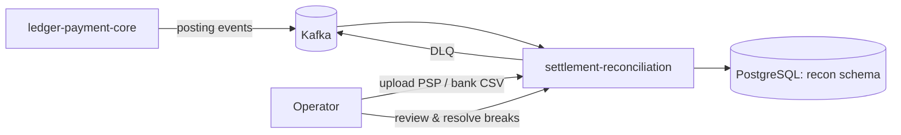
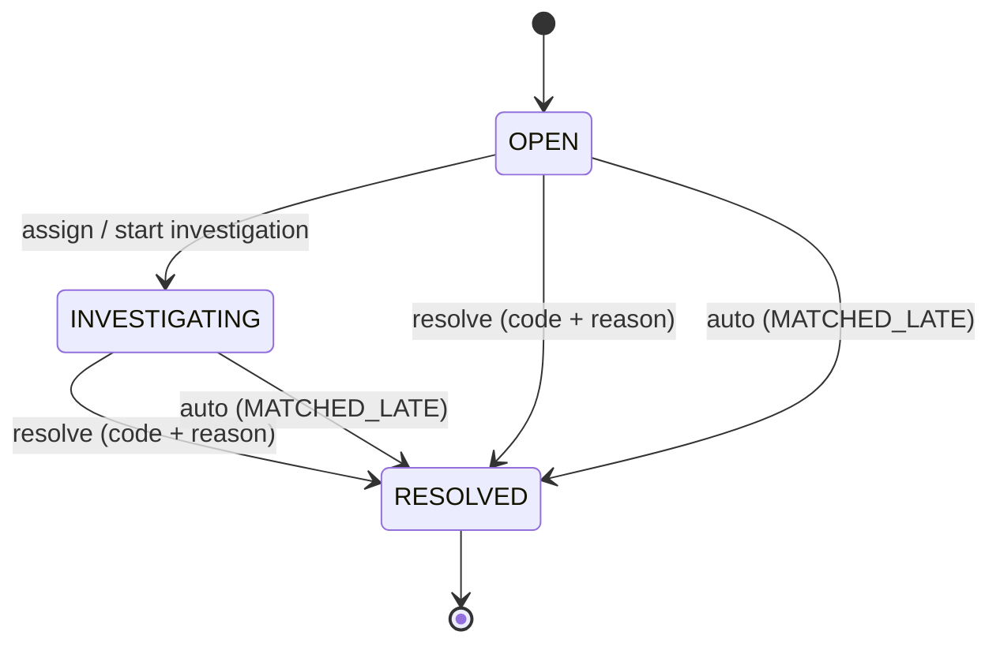

# Settlement Reconciliation — Technical Design Document

Version: 1.0
Status: Approved for implementation
Related system: `ledger-payment-core` (double-entry ledger, Java 21 / Spring Boot / PostgreSQL / Kafka)

---

## 1. Purpose

`ledger-payment-core` guarantees **internal** consistency: every transfer is balanced and
idempotent. It cannot tell whether money actually moved in the outside world.

`settlement-reconciliation` verifies **external** consistency. It compares what the ledger
says happened with what a payment service provider (PSP) reports it processed and what the
bank statement shows was actually paid out, and it produces an auditable list of
discrepancies ("breaks") that operators investigate and resolve.

This is a **three-way reconciliation**:

```
 Ledger postings  <── Stage A ──>  PSP settlement report lines  <── Stage B ──>  Bank statement lines
 (per transaction)                 (per transaction, grouped in batches)          (one net credit per batch)
```

---

## 2. Scope

### 2.1 In scope (v1)
- Consuming ledger posting events from Kafka into a local, read-only projection.
- Ingesting two file formats via HTTP upload: PSP settlement report CSV v1, bank statement CSV v1.
- Stage A matching (ledger ↔ PSP lines) and Stage B matching (PSP batches ↔ bank lines).
- Break detection, classification, lifecycle management, and an append-only audit trail.
- REST API for upload, runs, breaks, and summary reporting.
- Synthetic data generator with ground-truth labels and an accuracy/performance evaluation.
- Metrics, structured logging, authentication/authorization, threat model.

### 2.2 Out of scope (v1)
- Real bank or PSP connectivity (SFTP, EBICS, APIs). Files are uploaded manually.
- ISO 20022 `camt.053` / SWIFT MT940 parsing (possible v2; the parser port must allow adding it).
- Writing to the ledger. Reconciliation **never** posts adjustments; it only recommends.
- FX conversion. Cross-currency pairs are always a `CURRENCY_MISMATCH` break.
- Multi-tenancy, user interface, email/notification delivery.
- Subset-sum style matching (finding arbitrary groups of ledger entries that sum to a value).

---

## 3. Glossary

| Term | Meaning |
|------|---------|
| Ledger entry | A posting in `ledger-payment-core` on an account that is mapped to a PSP source. |
| Source | A configured external data provider: a PSP or a bank account. Has a type and a format. |
| PSP line | One transaction row in a PSP settlement report. |
| Batch | A group of PSP lines settled together; paid out as one bank credit. |
| Bank line | One row in a bank statement. |
| Match | A link between items that reconcile. Has a rule, a cardinality, and a status. |
| Break | A discrepancy that needs human attention. Has a type and a lifecycle. |
| Grace period | Time an item may stay unmatched before it becomes a break (settlement delay). |
| Run | One execution of the matching engine for a source and a value-date window. |
| Value date | The date funds are considered moved. Used for date windows. |

---

## 4. Requirements

IDs are stable. Tests and commit bodies reference them.

### 4.1 Ledger event consumption (FR-LED)
- **FR-LED-1** Consume ledger posting events from the topic(s) identified in Phase 0.
- **FR-LED-2** Store only entries on ledger accounts mapped to a configured source; ignore others.
- **FR-LED-3** Processing is idempotent: the same event delivered N times produces one row.
- **FR-LED-4** Offsets are committed only after the database transaction commits (at-least-once + dedupe).
- **FR-LED-5** Events that fail schema validation go to a dead-letter topic with error headers
  (`x-error-code`, `x-error-message`, `x-original-topic`, `x-original-offset`) and do not block the partition.
- **FR-LED-6** Events are validated against `contracts/ledger-events.schema.json`.

### 4.2 File ingestion (FR-ING)
- **FR-ING-1** Accept file upload via `POST /api/v1/statements` (multipart) with fields
  `source` (registered source code), `statementReference` (string), `file`.
- **FR-ING-2** The file format is determined by the source's configured type, not by the file name or extension.
- **FR-ING-3** File-level idempotency: a file whose SHA-256 was already ingested successfully is rejected with
  `409 Conflict` and the id of the original ingestion. `(source, statementReference)` is also unique.
- **FR-ING-4** Line-level idempotency: `(source, line_id)` is unique across all files; a duplicate line in a
  *new* file is recorded as a `DUPLICATE_LINE` break, not silently dropped.
- **FR-ING-5** Parsing is streaming; memory use must not grow with file size.
- **FR-ING-6** Ingestion of a file is atomic: either all valid lines are stored or none are.
- **FR-ING-7** Validation rules (§7) are applied per line. If the invalid-line ratio exceeds the configured
  threshold (default 0 — any invalid line rejects the file), the file is `REJECTED`; the response contains
  line numbers and error codes (never raw line content).
- **FR-ING-8** Limits (configurable): max file size 200 MB, max line length 4 KB, max 2,000,000 lines,
  UTF-8 only (a leading BOM is stripped), header row required and must match exactly.
- **FR-ING-9** The original filename is sanitized (allow-list `[A-Za-z0-9._-]`, max 100 chars) before being
  stored or logged; it is never used as a path.

### 4.3 Matching (FR-MAT)
- **FR-MAT-1** Matching is triggered by `POST /api/v1/runs` with `source` and `valueDateFrom`/`valueDateTo`,
  and automatically after a successful file ingestion for that file's source and date range.
- **FR-MAT-2** Matching is **incremental**: only items without an active match are considered.
  Existing active matches are never changed by a run.
- **FR-MAT-3** Rules run in a fixed, documented order (§8.2). The first rule that matches an item wins.
- **FR-MAT-4** The engine **never breaks ties arbitrarily**. If a rule finds more than one candidate,
  no match is made and an `AMBIGUOUS_MATCH` break is opened.
- **FR-MAT-5** Results are deterministic: the same set of unmatched items yields the same matches and
  breaks regardless of input order, insertion order, or database row order.
- **FR-MAT-6** Every match records rule id, rule version, run id, cardinality, and any amount difference.
- **FR-MAT-7** An operator can reverse a match (`POST /api/v1/matches/{id}/reversal`, reason required).
  The match becomes `REVERSED` (never deleted) and its items return to the unmatched pool.
- **FR-MAT-8** A run's configuration (tolerances, windows, grace periods, rule versions) is snapshotted
  onto the run record.

### 4.4 Breaks (FR-BRK)
- **FR-BRK-1** Break types (§8.3) are a closed enum.
- **FR-BRK-2** An item has at most one non-resolved break at a time (DB-enforced).
- **FR-BRK-3** Lifecycle: `OPEN → INVESTIGATING → RESOLVED`, and `OPEN → RESOLVED`. `RESOLVED` is terminal.
  Reopening creates a new break referencing the old one.
- **FR-BRK-4** Resolution requires a resolution code (§8.3) and a free-text reason (max 1000 chars).
- **FR-BRK-5** When a later run matches an item that has an open break, the break is auto-resolved with
  code `MATCHED_LATE` and actor `system`.
- **FR-BRK-6** Every state change writes a row to `break_events` (append-only, DB-enforced).
- **FR-BRK-7** Current break status must always equal the status derived by replaying its events.

### 4.5 API and reporting (FR-API)
- **FR-API-1** Endpoints listed in §11, versioned under `/api/v1`.
- **FR-API-2** Errors use RFC 9457 Problem Details; no internal details leak.
- **FR-API-3** List endpoints are paginated (cursor or page+size, max size 500) and filterable.
- **FR-API-4** `GET /api/v1/reports/summary?source=&valueDate=` returns counts and sums of matched,
  pending, and broken items per side, and open breaks by type and age bucket.
- **FR-API-5** `GET /api/v1/breaks/export?…` returns CSV with formula-injection neutralization.

### 4.6 Non-functional (NFR)
- **NFR-PERF-1** Ingest a 1,000,000-line PSP file with the JVM limited to `-Xmx512m`. Target: ≤ 60 s on
  the developer machine. Measured and reported, never estimated.
- **NFR-PERF-2** Stage A for 1,000,000 PSP lines against 1,000,000 ledger entries. Target: ≤ 120 s.
- **NFR-PERF-3** Kafka projection throughput target: ≥ 5,000 events/s sustained in the local setup.
- **NFR-REL-1** A crash during ingestion leaves no partial data; re-uploading the same file succeeds.
- **NFR-REL-2** A crash during a run leaves no partial matches; re-running is safe.
- **NFR-REL-3** Replaying the entire ledger topic from offset 0 produces no new rows.
- **NFR-SEC-1** All endpoints except health require authentication (§11).
- **NFR-SEC-2** No secret, credential, or unmasked identifier appears in logs (verified by a test that
  captures logs during an end-to-end flow).
- **NFR-OBS-1** Metrics and structured logs per §12.
- **NFR-TEST-1** Line coverage: `domain` ≥ 90 %, overall ≥ 80 % (JaCoCo). Coverage is a floor, not a goal.
- **NFR-OPS-1** `docker compose up` starts PostgreSQL and Kafka locally; the app starts with one command.
- **NFR-OPS-2** CI (GitHub Actions) runs build, unit, and integration tests on every push.

Targets that are not met are reported with measurements and analysis; they are not silently lowered.

---

## 5. Architecture

### 5.1 Context



Reconciliation owns its own database. It never reads the ledger's database and never
calls the ledger's API. The only coupling is the event contract in `contracts/`.

### 5.2 Internal structure (hexagonal)

```
<base-package>.recon
├── domain            pure Java: Money, items, matching rules, break state machine, invariants
├── application       use cases + ports (interfaces): IngestStatement, RunMatching, TransitionBreak …
├── adapters
│   ├── in
│   │   ├── web       REST controllers, request/response DTOs, problem-details handler
│   │   ├── kafka     ledger event listener, schema validation, DLQ publishing
│   │   └── file      streaming CSV parsers (one per format) implementing a StatementParser port
│   └── out
│       └── persistence   repositories (JDBC for bulk paths), Flyway migrations live in resources
└── config            Spring configuration, properties binding, security
```

ArchUnit rules (Phase 1):
- `domain` depends on nothing outside `java.*` and itself.
- `application` depends only on `domain`.
- `adapters` depend on `application` and `domain`, never on each other.
- Controllers never access repositories directly.

`<base-package>` follows the ledger's convention (confirmed in Phase 0).

### 5.3 Processing flows

**Ledger projection**
1. Listener receives event → validate against JSON Schema → reject to DLQ if invalid.
2. Filter: account mapped to a source? If not, ack and skip.
3. `INSERT … ON CONFLICT (event_id) DO NOTHING` into `ledger_entries` in one transaction.
4. Commit DB transaction → acknowledge offset.

**File ingestion**
1. Controller checks auth, size header, source exists, `statementReference` format.
2. Stream the upload to a temp file while computing SHA-256 (never hold the file in memory).
3. Reject on duplicate hash / duplicate `(source, statementReference)`.
4. Parse in streaming mode; validate each line; collect errors (line number + code).
5. In one transaction: insert `statement_files` row, batch-insert lines (JDBC batch, size 1,000),
   record duplicate-line breaks, set status `INGESTED`. On any failure: rollback, status `REJECTED`
   recorded in a separate transaction.
6. Delete the temp file in all cases.
7. Trigger a run for the affected source and value-date range.

**Matching run**
1. Acquire a PostgreSQL advisory lock keyed by source (one run per source at a time).
2. Create `reconciliation_runs` row with config snapshot.
3. Stage A (if source type is PSP), then Stage B (if a bank source is linked and has lines in range).
4. Persist matches, open breaks, auto-resolve breaks — in one transaction per run.
5. Record run statistics; release lock.

---

## 6. Money and numbers

- Amounts are exact decimals. Domain type `Money(BigDecimal amount, CurrencyCode currency)`.
- Scale equals the currency's ISO 4217 minor units (TRY/EUR/USD = 2, JPY = 0). Any input with a
  larger scale is **invalid**, never rounded.
- Arithmetic between different currencies throws.
- Database type: `NUMERIC(19,4)` plus a `CHAR(3)` currency column, with a `CHECK` that the currency
  is in the supported set. **If the ledger uses minor units as `BIGINT`, Phase 0 records this and the
  projection converts at the boundary; the domain type stays `Money`.**
- Sign convention (from the perspective of our settlement account):
  - Ledger: an entry increasing the mapped clearing account balance is positive. Exact mapping from
    the ledger's debit/credit representation is determined in Phase 0 and documented in
    `docs/ledger-integration-notes.md`.
  - PSP: `gross_amount` positive for payments, negative for refunds and chargebacks.
    `net_amount = gross_amount − fee_amount`. Fees are non-negative.
  - Bank: `amount` positive for credits to our account, negative for debits.

---

## 7. File formats

Both formats: UTF-8, comma-separated, RFC 4180 quoting, `\n` or `\r\n` line endings, one header row,
decimal point `.`, no thousands separators, dates `YYYY-MM-DD`.

### 7.1 PSP settlement report CSV v1

Header (exact):
```
line_id,transaction_reference,batch_id,transaction_date,value_date,type,gross_amount,fee_amount,net_amount,currency
```

| Column | Type | Rules |
|---|---|---|
| line_id | string | 1–64 chars `[A-Za-z0-9_-]`, unique per source |
| transaction_reference | string | 0–64 chars; empty allowed (triggers fallback rule A3) |
| batch_id | string | 1–64 chars `[A-Za-z0-9_-]` |
| transaction_date | date | not after value_date |
| value_date | date | required |
| type | enum | `PAYMENT`, `REFUND`, `CHARGEBACK` |
| gross_amount | decimal | PAYMENT > 0; REFUND/CHARGEBACK < 0 |
| fee_amount | decimal | ≥ 0 |
| net_amount | decimal | must equal gross − fee exactly |
| currency | ISO 4217 | supported set: TRY, EUR, USD (configurable) |

### 7.2 Bank statement CSV v1

Header (exact):
```
line_id,booking_date,value_date,amount,currency,reference,description
```

| Column | Type | Rules |
|---|---|---|
| line_id | string | 1–64 chars `[A-Za-z0-9_-]`, unique per source |
| booking_date | date | required |
| value_date | date | required |
| amount | decimal | non-zero |
| currency | ISO 4217 | supported set |
| reference | string | 0–140 chars; batch id extracted with the source's configured regex |
| description | string | 0–140 chars; stored, never used for matching |

### 7.3 Validation error codes
`HEADER_MISMATCH`, `LINE_TOO_LONG`, `INVALID_ENCODING`, `COLUMN_COUNT`, `REQUIRED_MISSING`,
`INVALID_FORMAT`, `INVALID_DATE`, `INVALID_AMOUNT`, `SCALE_EXCEEDS_CURRENCY`, `SIGN_TYPE_MISMATCH`,
`NET_AMOUNT_MISMATCH`, `UNSUPPORTED_CURRENCY`, `DATE_ORDER`, `DUPLICATE_LINE_IN_FILE`.

---

## 8. Matching and breaks

### 8.1 Source configuration (application config, not DB, in v1)

```yaml
recon:
  sources:
    - code: PSP_ALPHA
      type: PSP_SETTLEMENT
      ledger-accounts: [ "<clearing account id from Phase 0>" ]
      value-date-window-days: 2        # business days, ± around ledger value date
      grace-days-ledger-unmatched: 3   # business days before MISSING_IN_PSP
      grace-days-psp-unmatched: 1      # business days before MISSING_IN_LEDGER
      settles-to: BANK_MAIN
    - code: BANK_MAIN
      type: BANK_STATEMENT
      batch-id-pattern: "BATCH[-_]?([A-Za-z0-9_-]{1,64})"
      grace-days-batch-unpaid: 2       # business days before MISSING_SETTLEMENT
  business-calendar:
    weekend: [ SATURDAY, SUNDAY ]
    holidays: [ ]                      # ISO dates, configurable
```

### 8.2 Rules (fixed order)

**Stage A — ledger entries ↔ PSP lines (1:1)**

| Order | Rule id | Condition | Outcome |
|---|---|---|---|
| 1 | `A1_EXACT_REFERENCE` | same non-empty reference, same currency, `ledger.amount == psp.gross_amount`, value dates within window | Match 1:1 |
| 2 | `A2_REFERENCE_CONFLICT` | same non-empty reference but currency or amount differs | No match. Break `CURRENCY_MISMATCH` or `AMOUNT_MISMATCH` on the PSP line, related item = ledger entry |
| 3 | `A3_FALLBACK_UNIQUE` | PSP line with empty/unknown reference; exactly one unmatched ledger entry with same currency, same amount, value date within window | Match 1:1, flagged `low_confidence = true` |
| — | ambiguity | A1 or A3 finds > 1 candidate | No match. Break `AMBIGUOUS_MATCH` on the PSP line, related items = all candidates |

Duplicate references: if two PSP lines carry the same reference, neither is matched by A1;
both get `DUPLICATE_LINE` breaks. (Never guess which one is the real one.)

**Stage B — PSP batches ↔ bank lines (N:1)**

| Order | Rule id | Condition | Outcome |
|---|---|---|---|
| 1 | `B1_BATCH_TOTAL` | bank line reference yields batch id via regex, batch exists, same currency, `bank.amount == Σ psp.net_amount` of all lines in the batch | Match N:1 (all batch lines + bank line) |
| 2 | `B2_BATCH_CONFLICT` | batch id found but sum or currency differs | Break `BATCH_AMOUNT_MISMATCH` on the bank line with expected vs actual |
| 3 | unmatched | bank line with no extractable/known batch id | Break `UNEXPECTED_BANK_LINE` |

A batch is considered complete only when all its PSP lines are ingested; batches are
identified per PSP source. Mixed-currency batches are invalid → `BATCH_AMOUNT_MISMATCH`.

**Grace-period breaks (evaluated at the end of each run, using the injected `Clock`)**
- Ledger entry unmatched past `grace-days-ledger-unmatched` → `MISSING_IN_PSP`.
- PSP line unmatched past `grace-days-psp-unmatched` → `MISSING_IN_LEDGER`.
- Batch without bank line past `grace-days-batch-unpaid` → `MISSING_SETTLEMENT`.
- Items inside their grace period are `PENDING` (reported, not a break).

### 8.3 Break types and resolution codes

Break types: `MISSING_IN_PSP`, `MISSING_IN_LEDGER`, `AMOUNT_MISMATCH`, `CURRENCY_MISMATCH`,
`DUPLICATE_LINE`, `AMBIGUOUS_MATCH`, `MISSING_SETTLEMENT`, `BATCH_AMOUNT_MISMATCH`, `UNEXPECTED_BANK_LINE`.

Resolution codes: `MATCHED_LATE` (system only), `MATCHED_MANUALLY`, `ADJUSTMENT_REQUIRED_IN_LEDGER`,
`PSP_ERROR_CONFIRMED`, `BANK_ERROR_CONFIRMED`, `WRITTEN_OFF`, `FALSE_POSITIVE`, `DUPLICATE_CONFIRMED`.

### 8.4 Break lifecycle



Append-only enforcement for `break_events` and `match_events`:
- Application DB role has `INSERT, SELECT` only on these tables.
- A trigger raises an exception on `UPDATE` or `DELETE` (defence in depth).
- A test proves both mechanisms reject modification.

---

## 9. Invariants

Each invariant must be enforced by a mechanism **and** verified by at least one test.

| ID | Invariant | Primary mechanism |
|---|---|---|
| INV-1 | Completeness: after a run, every in-scope item is exactly one of MATCHED, PENDING, or BROKEN. | Run finalization check + property test |
| INV-2 | Exclusivity: an item belongs to at most one ACTIVE match. | Partial unique index on `match_items(side, item_id) WHERE active` |
| INV-3 | Ingestion idempotency: re-ingesting a file or replaying events creates zero new rows. | Unique constraints on hash, `(source, line_id)`, `event_id` |
| INV-4 | Conservation: per side and run scope, Σ matched + Σ pending + Σ broken = Σ in scope, per currency. | Summary query + test |
| INV-5 | Determinism: shuffling inputs does not change results. | Stable ordering + no arbitrary tie-breaks; jqwik property test |
| INV-6 | Audit integrity: break/match events are append-only and current status = replayed status. | Privileges + trigger + replay test |
| INV-7 | One open break per item. | Partial unique index on `breaks(item_side, item_id) WHERE status <> 'RESOLVED'` |
| INV-8 | Money exactness: no floating point anywhere in the money path; no silent rounding. | `Money` type, ArchUnit rule banning `double`/`float` in domain, validation |
| INV-9 | Ledger isolation: the service never writes to the ledger or its database. | No ledger DB credentials; no producer on ledger topics; ArchUnit/config test |

---

## 10. Data model (logical; exact DDL in migrations)

```
sources_state         (source_code PK, last_run_id, updated_at)            -- operational state only
ledger_entries        (id UUID PK, event_id UNIQUE, ledger_entry_id, account_id, source_code,
                       reference, amount NUMERIC, currency CHAR(3), value_date, occurred_at, received_at)
statement_files       (id UUID PK, source_code, statement_reference, sha256 CHAR(64) UNIQUE,
                       sanitized_filename, size_bytes, line_count, status, error_summary JSONB,
                       uploaded_by, received_at, UNIQUE(source_code, statement_reference))
psp_lines             (id UUID PK, file_id FK, source_code, line_id, reference, batch_id, type,
                       transaction_date, value_date, gross_amount, fee_amount, net_amount, currency,
                       UNIQUE(source_code, line_id))
bank_lines            (id UUID PK, file_id FK, source_code, line_id, booking_date, value_date,
                       amount, currency, reference, extracted_batch_id, description,
                       UNIQUE(source_code, line_id))
reconciliation_runs   (id UUID PK, source_code, value_date_from, value_date_to, status,
                       config_snapshot JSONB, stats JSONB, started_at, finished_at, triggered_by)
matches               (id UUID PK, run_id FK, rule_id, rule_version, cardinality, status,
                       amount_difference NUMERIC, low_confidence BOOL, created_at)
match_items           (match_id FK, side, item_id, active BOOL, PRIMARY KEY(match_id, side, item_id))
match_events          (id BIGSERIAL PK, match_id FK, event_type, actor, reason, occurred_at)   -- append-only
breaks                (id UUID PK, break_type, item_side, item_id, related_items JSONB, status,
                       resolution_code, opened_run_id, previous_break_id, opened_at, resolved_at)
break_events          (id BIGSERIAL PK, break_id FK, from_status, to_status, resolution_code,
                       actor, reason, occurred_at)                                             -- append-only
```

`side` / `item_side` ∈ `LEDGER`, `PSP`, `BANK`, `BATCH`.
All status/type columns have `CHECK` constraints listing allowed values.

---

## 11. API

| Method | Path | Role | Purpose |
|---|---|---|---|
| POST | `/api/v1/statements` | OPERATOR | Upload PSP or bank file |
| GET | `/api/v1/statements/{id}` | VIEWER | File status, counts, validation errors |
| POST | `/api/v1/runs` | OPERATOR | Trigger a run |
| GET | `/api/v1/runs/{id}` | VIEWER | Run status and stats |
| GET | `/api/v1/matches?source=&rule=&from=&to=` | VIEWER | List matches |
| POST | `/api/v1/matches/{id}/reversal` | OPERATOR | Reverse a match (reason required) |
| GET | `/api/v1/breaks?status=&type=&source=&olderThanDays=` | VIEWER | List breaks |
| GET | `/api/v1/breaks/{id}` | VIEWER | Break with related items and event history |
| POST | `/api/v1/breaks/{id}/transitions` | OPERATOR | Change status (`targetStatus`, `resolutionCode`, `reason`) |
| GET | `/api/v1/breaks/export?…` | VIEWER | CSV export (injection-safe) |
| GET | `/api/v1/reports/summary?source=&valueDate=` | VIEWER | Reconciliation summary |
| GET | `/actuator/health` | public | Liveness/readiness |
| GET | `/actuator/prometheus` | METRICS | Metrics scrape |

### 11.1 Security design
- Spring Security, HTTP Basic over localhost in v1 (documented as a v1 simplification; production would
  use an OAuth2 resource server). Users and bcrypt hashes come from environment variables; none are in
  the repo. Roles: `VIEWER`, `OPERATOR` (includes VIEWER), `METRICS`.
- The authenticated principal is recorded as `actor` in all events and as `uploaded_by`/`triggered_by`.
- Request body limits configured at the servlet level to match FR-ING-8.
- Rate of uploads is not limited in v1; documented in the threat model.
- Phase 9 produces `docs/threat-model.md` (STRIDE per component: upload, Kafka listener, API, DB).

---

## 12. Observability

Metrics (Micrometer, Prometheus):
- `recon_ledger_events_total{result=stored|duplicate|skipped|dlq}`
- `recon_statement_lines_ingested_total{source, format}`
- `recon_statement_files_total{source, status}`
- `recon_run_duration_seconds{source, stage}` (histogram)
- `recon_matches_total{source, rule}`
- `recon_breaks_open{source, type}` (gauge)
- `recon_breaks_age_days{source, type}` (histogram)

Logging: JSON structured logs, correlation id per request / run / consumed record (MDC),
identifiers masked, no file contents.

---

## 13. Testing strategy

| Level | Tooling | Focus |
|---|---|---|
| Unit | JUnit 5, AssertJ | Money, parsers (per line), rules, state machine |
| Property | jqwik | INV-1, INV-4, INV-5, Money arithmetic |
| Contract | JSON Schema validator | Ledger event samples from the ledger repo validate against `contracts/` |
| Integration | Testcontainers (PostgreSQL, Kafka) | Projection idempotency, ingestion atomicity, append-only enforcement, API security |
| Architecture | ArchUnit | Layering, no float/double in domain, no ledger writes |
| End-to-end | Testcontainers + generator | Full three-way flow on a labeled dataset |
| Performance | Separate Maven/Gradle profile or task, not in default CI | NFR-PERF-* |

### 13.1 Synthetic data generator (Phase 8)
- Deterministic by seed. Produces: ledger events (published to Kafka or written as JSON lines),
  PSP CSV, bank CSV, and a ground-truth file listing the expected outcome for every item.
- Injected discrepancy types with configurable rates: missing PSP line, missing ledger entry,
  amount difference, currency difference, duplicate PSP line, empty reference (unique and ambiguous),
  late settlement (inside and outside grace), batch sum mismatch, unexpected bank line.
- Evaluation output: per break type precision and recall, overall match rate, runtime and peak heap.
  Target: precision = recall = 100 % for all deterministic types. Any gap is analysed in the report.

---

## 14. Phases

Each phase ends with a report (see `CLAUDE.md` §5). A phase is done only when every exit criterion is met.

### Phase 0 — Discovery and contract extraction (no application code)
Goal: replace every assumption about the ledger with facts.
- Read `..\ledger-payment-core` (read-only): build tool and wrapper, Java/Spring Boot versions,
  base package convention, persistence approach (JPA/JDBC), Lombok usage, money representation,
  account model, Kafka topics, event payloads, event id / idempotency keys, which field carries a
  reference that a PSP would echo back, debit/credit sign conventions, Docker images used.
- Produce:
  - `contracts/ledger-events.schema.json` (JSON Schema draft 2020-12) for the consumed event(s).
  - `contracts/samples/*.json` — at least 3 valid and 3 invalid sample events (synthetic values).
  - `docs/ledger-integration-notes.md` — every finding above with file:line references into the ledger.
  - `docs/adr/0001-separate-service-and-repository.md`.
  - `docs/adr/0002-json-schema-contract-instead-of-schema-registry.md`.
  - `.gitignore`, `.gitattributes` (if not already present), `.editorconfig`.
- Exit criteria:
  - Every "Phase 0 determines" item in this TDD has an answer with evidence, or is listed as an open question.
  - Samples validate/fail against the schema as expected (verified with a documented command).
  - A list of TDD assumptions that are contradicted by the ledger, with proposed TDD changes.

### Phase 1 — Project skeleton
- Build with wrapper, Spring Boot app, profiles (`local`, `test`), `.env.example`.
- `docker-compose.yml`: PostgreSQL + Kafka, ports on `127.0.0.1`, named volumes, healthchecks.
- Flyway baseline migration creating the schema and the two DB roles (migration role, app role).
- ArchUnit rules from §5.2 and INV-8/INV-9 (ban `float`/`double` in `domain`).
- JaCoCo configured with thresholds from NFR-TEST-1 (enforced from Phase 2 onward).
- GitHub Actions workflow: build + all tests (Testcontainers on `ubuntu-latest`).
- Actuator restricted to `health`, `info`, `prometheus`. Placeholder README.
- Exit: `docker compose up -d` + app start succeeds; `/actuator/health` is UP; CI config valid;
  ArchUnit tests pass; a test proves the app DB role cannot run DDL.

### Phase 2 — Domain model and persistence
- `Money`, `CurrencyCode`, business-day calendar, item types, match and break domain models,
  break state machine (pure domain).
- Migrations for all tables in §10 with constraints, partial unique indexes, append-only trigger and grants.
- Repositories (JDBC batch for bulk inserts).
- Exit: unit tests for Money (incl. jqwik), calendar, state machine (all legal and illegal transitions);
  integration tests prove INV-2, INV-7 constraints and INV-6 append-only enforcement (both privilege and trigger).

### Phase 3 — Ledger event consumer
- Listener, schema validation, account-to-source filter, idempotent insert, manual ack after commit, DLQ.
- Exit: FR-LED-1…6 covered; tests for duplicate delivery, replay from offset 0 (NFR-REL-3), invalid event
  → DLQ with headers and partition not blocked, crash-before-commit redelivery; contract test using
  `contracts/samples`; throughput measured (NFR-PERF-3).

### Phase 4 — Statement ingestion
- Upload endpoint (auth stubbed or real per Phase 1 security baseline), temp-file streaming with SHA-256,
  parsers for both formats behind a `StatementParser` port, validation codes (§7.3), atomic insert,
  rejection summary, duplicate handling (FR-ING-3/4), filename sanitization, limits.
- Exit: FR-ING-1…9 covered; tests for every validation code, atomicity under injected failure mid-file,
  duplicate file, duplicate `statementReference`, duplicate line across files, BOM, CRLF, oversize file,
  oversize line, non-UTF-8 bytes; streaming verified with a 1,000,000-line generated file under `-Xmx512m`
  (performance profile, not default CI).

### Phase 5 — Stage A matching
- Run orchestration (advisory lock, config snapshot, single transaction), rules A1–A3, ambiguity handling,
  duplicate-reference handling, grace-period evaluation for ledger and PSP sides, PENDING status.
- Exit: FR-MAT-1…6, FR-MAT-8 for Stage A; INV-1, INV-4, INV-5 property tests (shuffled inputs, fixed seed);
  test that an existing active match is never altered by a later run; concurrent run attempt on the same
  source is rejected or serialized.

### Phase 6 — Stage B matching
- Batch aggregation, regex batch-id extraction, rules B1–B2, `UNEXPECTED_BANK_LINE`, `MISSING_SETTLEMENT`
  with grace, mixed-currency batch handling.
- Exit: Stage B rules covered; INV-1/INV-4/INV-5 extended to Stage B; end-to-end three-way test with a
  small hand-written dataset whose expected results are asserted item by item.

### Phase 7 — Break management and API
- Break transitions endpoint, resolution codes, reopen-as-new-break, auto-resolve `MATCHED_LATE`, match
  reversal (FR-MAT-7) with events, list/detail/export/summary endpoints, Problem Details, pagination.
- Exit: FR-BRK-1…7, FR-API-1…5 covered; INV-6 replay test; export injection test; authorization tests for
  every endpoint (VIEWER cannot mutate, unauthenticated gets 401).

### Phase 8 — Synthetic data generator and evaluation
- Generator (§13.1) as a separate module or `test`-scoped tool, deterministic by seed.
- Evaluation runner producing `docs/evaluation.md`: precision/recall per break type, match rate, and
  NFR-PERF-1/2/3 measurements with machine description and exact commands.
- Exit: evaluation reproducible from a single documented command; every metric below target is analysed.

### Phase 9 — Observability and security hardening
- Metrics and structured logging per §12, masking, log-capture test (NFR-SEC-2), Spring Security finalized
  per §11.1, dependency vulnerability scan in CI (OWASP Dependency-Check or equivalent), `docs/threat-model.md`.
- Exit: NFR-SEC-1/2, NFR-OBS-1 covered; scan passes or findings are documented with justification;
  threat model covers upload, listener, API, and DB.

### Phase 10 — Documentation and release readiness
- README: problem statement, three-way diagram (Mermaid), how to run, API overview, invariants table with
  links to tests, evaluation and benchmark tables, design decisions with ADR links, limitations and v2 ideas.
- ADRs: `0003-three-way-reconciliation`, `0004-incremental-matching-without-arbitrary-tie-breaks`,
  `0005-append-only-audit-enforced-in-database`.
- `docs/runbook.md`: how an operator handles each break type.
- Exit: a new developer can clone, run, and reproduce the evaluation using only the README.
  The owner creates the release tag.

---

## 15. Open questions (resolved during Phase 0 or by the owner)

1. Exact ledger event topic(s) and payload shape.
2. Which ledger field is the external reference a PSP would echo.
3. Ledger money representation and debit/credit sign convention.
4. Ledger's Spring Boot version, build tool, persistence style, base package.
5. License (match the ledger's license unless the owner decides otherwise).
